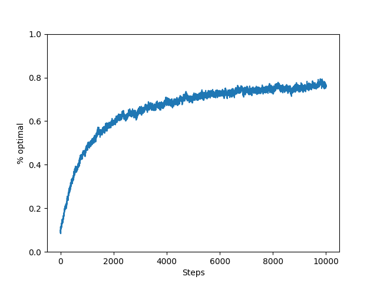

# Exercise 2.5 — Non-stationary 10-armed bandit

**Problem Statement**
Design and conduct an experiment to demonstrate the difficulties that
sample-average methods have for nonstationary problems. Use a modified
version of the 10-armed testbed in which all the $q_*(a)$ start out equal and then take independent random walks (say by adding a normally 
distributed increment with mean zero and standard deviation 0.01 to all 
the $q_*(a)$ on each step). Prepare plots like Figure 2.2 for an action-
-value method using a constant step-size parameter, $\alpha$ = 0.1. Use
$\epsilon$ = 0.1 and longer runs, say of 10,000 steps.

**Code:** [here.](../../suttonbarto/chapter2/nonstationary.py)

## Average Reward

Compared to Figure 2.2 in Sutton & Barto, the algorithm takes far more steps to converge. Even after 10,000 steps it hasn't converged fully. This reward band is also noisier due to the independent random walks added to each reward distribution at each step. 

## % Optimal Action

After 10,000 steps, the algorithm chooses the optimal action approximately 80% of the time. This is around the same as the $\epsilon=0.1$ sample-average method in Sutton & Barto's Figure 2.2 but there the convergence is achieved with an order of magnitude fewer steps.