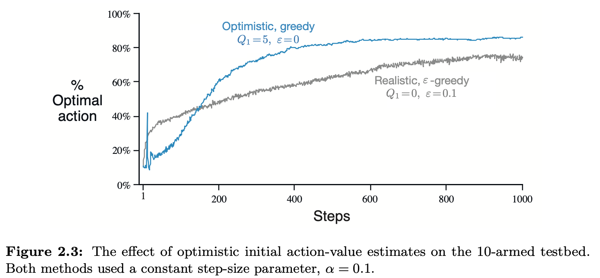

# Exercise 2.6 — Mysterious Spikes

**Problem Statement**
The results shown in Figure 2.3 should be quite reliable because they are averages over 2000 individual, randomly chosen 10-armed bandit tasks. Why, then, are there oscillations and spikes in the early part of the curve for the optimistic method? In other words, what might make this method perform particularly better or worse, on average, on particularly early steps?

## Figure 2.3

# Solution

Since all initial value estimates are 5, the agent's first 10 greedy action choices will almost surely be random tie-breaks (unless a reward obtained is $>=5$ standard deviations above the mean of 1). So the chance that any action chosen is optimal is 10% for a 10-armed bandit. Hence the blue curve hovering around 10% initially in Figure 2.3. Once all 10 actions have been chosen once, the agent has been disappointed by all actions yet it is likely that the optimal action (the one with the greatest average reward) is correctly ranked as #1 within the agent's value estimates since it likely returned the *least disappointing* reward on the first round of exploration. In this case, the 11th action chosen by a greedy policy will often be the optimal one hence the sudden spike to >40% optimal action choice. However, once this optimal action is chosen, it again disappoints the agent and drops the value estimate for that action. And so on the next few action choices, other actions are likely to be chosen since they have yet to disappoint the agent's initially wildly optimistic value estimates *twice*. 