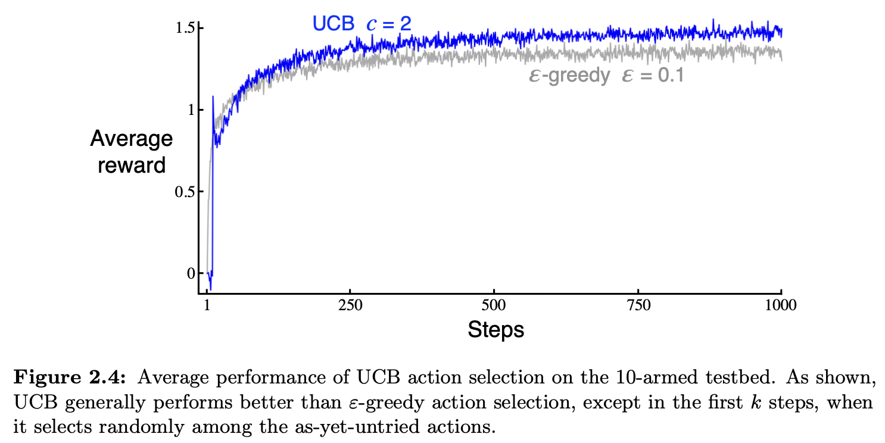

# Exercise 2.8 - UCB Spikes

**Problem Statement**
In Figure 2.4 the UCB algorithm shows a distinct spike in performance on the 11th step. Why is this? Note that for your answer to be fully satisfactory it must explain both why the reward increases on the 11th step and why it decreases on the subsequent steps. Hint: If $c=1$, then the spike is less prominent.

## Figure 2.4

# Solution

When an action has yet to be tried, the UCB method displayed in Figure 2.4 defines this action as maximizing its decision-rule. That is, when $N_t(a) = 0$, that $a$ is considered to maximize:

$$A_t \doteq \argmax_a Q_t(a) + c \sqrt{\frac{\ln t}{N_t(a)}}$$

This problem has 10 arms to choose from and so in the first 10 steps the bandit will attempt each of the 10 actions once. On the 11th step, the bandit is employing its UCB action selection (per the equation above) truly for the first time. This is a switch from essentially choosing actions indiscriminately (i.e. exploring) in the first 10 steps to choosing the action with the greatest upper confidence bound on its value estimate. This switch occurs in every one of the 2000 random replicates of this experiment. This explains why at step 11, we observe a spike upwards in reward. 

Also, note that after the first 10 steps, because each action is chosen just once, the confidence bound on the 11-th step is $Q_11(a) + c\sqrt{\ln 11}$ for every arm $a$. Therefore, the only difference is in the first-round reward received for each action. This means that in expectation, the height of the single reward obtained on step 11 is unaffected by changing $c$. 

Because the action with the largest first-round reward is chosen on step 11, it is likely that there was some luck involved (an anomalously high reward from this arm) and so the actual reward the bandit receives will almost surely be disappointing smaller, knocking down the UCB estimate for that action.

In particular, let $a^*$ denote the action with largest first-round reward. Then,

$\text{UCB}_{12}(a^*) = Q_{12}(a^*) + c\sqrt{\ln{12} / 2}$

Whereas for all other actions $b \neq a^*$,

$\text{UCB}_{12} = Q_{12}(b) + c \sqrt{\ln 12}$

The gap in these UCB's introduced solely by the 'bonus' term is $c \sqrt{\ln 12}(1 - \frac{1}{\sqrt{2}}) \approx 0.46c$. So for every unit increase in $c$, the UCB of all other actions $b \neq a^*$ increases by 0.46. For larger values of $c$, this makes it increasingly likely that an action $b \neq a^*$ will be chosen on step 12. This causes the bandit to jump to a different, uncertain arm in step 12, which is likely to have a lesser true mean reward than that of $a^*$ causing the reward to drop. For a smaller value of $c$, the 'bonus gap' is smaller and so the high empirical mean of $a^*$ is more likely to outweigh it causing the bandit to stick with the action which receives highest first-round reward in step 12.