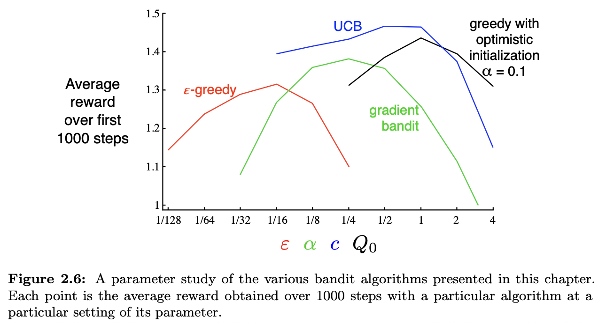
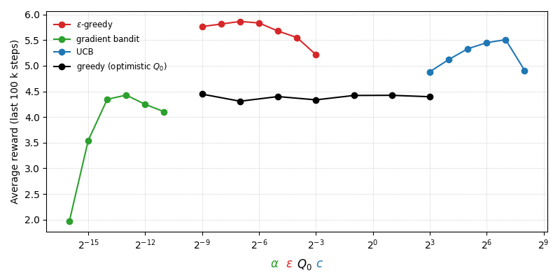

# Exercise 2.11 - Nonstationary bandit parameter study

**Problem Statement**
Make a figure analogous to Figure 2.6 [below] for the nonstationary case outlined in Exercise 2.5. Include the constant-step-size $\epsilon$-greedy algorithm with $\alpha=0.1$. Use runs of 200,000 steps and, as a performance measure for each algorithm and parameter setting, use the average reward over the last 100,000 steps.

## Figure 2.6

# Solution

**Code:** [here.](../../suttonbarto/chapter2/param_study.py)

Some interesting observations:
* $\epsilon$-greedy does best with UCB in second. Whereas $\epsilon$-greedy did the worst in the stationary case (see Fig 2.6 above).
* Optimistic greedy is very insensitive to $Q_0$ in the nonstationary case. 
* Gradient bandit is more sensitive to undershooting the learning rate $\alpha$ than overshooting it in the nonstationary case. Likely because an insufficient learning rate means the agent can never catch up to the shifting underlying rewards, which is worse than overcorrecting (due to overly large $\alpha$).