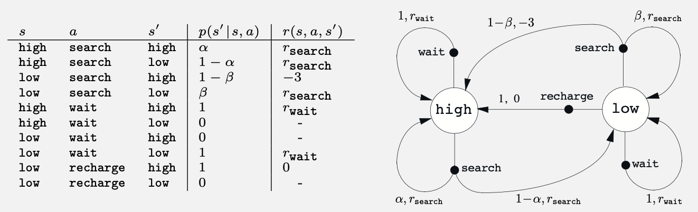

# Exercise 3.4 - Deriving one-step dynamics from state transition probabilities

**Problem Statement**
Give a table analogous to that in Example 3.3 (below), but for $p(s',r|s,a)$. It should have columns for $s,a,s',r,$ and $p(s',r|s,a)$, and a row for every 4-tuple for which $p(s',r|s,a)>0.$

Example 3.3:

# Solution
The goal is to obtain the environment's one-step dynamics (i.e. state-reward transition probabilities) from its state-transition probabilities, $p(s'|s,a)$. The latter is a marginalization of the former over the rewards.

| $s$ | $a$ | $s'$ | $r$ | $p(s', r \| s, a)$ |
|---------|----------|-------|-------|-------|
| high | search | high | $r_\text{search}$ | $\alpha$ |
| high | search | low | $r_\text{search}$ | $1 - \alpha$ |
| high | wait | high | $r_\text{wait}$ | 1 |
| low | search | low | $r_\text{search}$ | $\beta$ |
| low | search | high | -3 | $1-\beta$ |
| low | wait | low | $r_\text{wait}$ | 1 |
| low | recharge | high | 0 | 1 |

Takeaways: 
* In the one-step dynamics table, there is one row (with non-zero probability) for each arrow in the state transition graph. 
* In this problem, the state transitions are uncertain but the rewards associated with each state are deterministic. That is,

$$p(s',r|s,a) = \begin{cases}p(s' | s,a) \quad \text{if } r = r(s,a,s') \\ 0 \quad \text{otherwise} \end{cases}$$