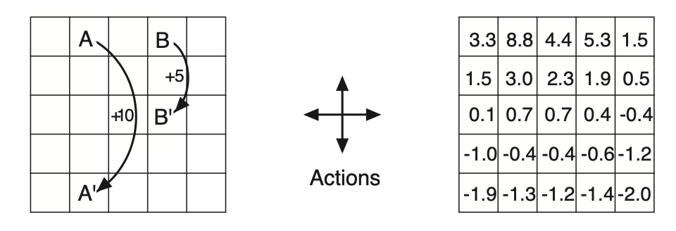

# Exercise 3.15 - Adding a constant to all rewards in a continuing task

**Problem Statement**
In the gridworld example, rewards are positive for goals, negative for running into the edge of the world, and zero the rest of the time. Are the signs of these rewards important, or only the intervals between them? Prove, using equation 3.8 (below), that adding a constant $c$ to all the rewards adds a constant, $v_c$, to the values of all states, and thus does not affect the relative values of any states under any policies. What is $v_c$ in terms of $c$ and $\gamma$?

$$G_t \doteq R_{t+1} + \gamma R_{t+2} + \gamma^2 R_{t+3} + ... = \sum\limits_{k=0}^\infty \gamma^k R_{t+k+1} \tag{3.8}$$

**Example 3.5: Gridworld**
Figure 3.2 (left; below) shows a rectangular gridworld representation of a simple finite MDP. The cells of the grid correspond to the states of the environment. At each cell, four actions are possible: north, south, east and west, which deterministically cause the agent to move one cell in the respective direction on the grid. Actions that would take the agent off the grid leave its location unchanged, but also result in a reward of -1. Other actions result in a reward of 0, except those that move the agent out of the special states A and B. From state A, all four actions yield a reward of +10 and take the agent to A'. From state B, all actions yield a reward of +5 and take the agent to B'. 

Figure 3.2: Gridworld example: exceptional reward dynamics (left) and state-value function for the equiprobable random policy (right). 

# Solution

Recall the definition of state-value:

$$v_\pi(s) \doteq \mathbb{E}_\pi[G_t | S_t = s]$$

By adding a constant, $c$, to all rewards the modified return becomes

$$G'_t = (R_{t+1} + c) + \gamma(R_{t+2} + c) + \gamma^2 (R_{t+3} + c) + ... = \sum\limits_{k=0}^\infty \gamma^k (R_{t+k+1} + c)$$

We can distribute $\gamma$, split the sum and pull the constant $c$ in front

$$G'_t = \sum\limits_{k=0}^\infty \gamma^k R_{t+k+1} + c \sum\limits_{k=0}^\infty \gamma^k = G_t + c\sum\limits_{k=0}^\infty \gamma^k$$

Because Gridworld is a continuing task, the horizon is truly infinite. The infinite sum of $\gamma^k$ is the classic geometric series and has a known limit of $\frac{1}{1-\gamma}$. Therefore, 

$$G'_t = G_t + \frac{c}{1-\gamma}$$

Returning to our definition of state-value, we can substitute $G'_t$ for $G_t$ to see the effect that adding a constant $c$ to all rewards has on the state-values

$$v_\pi(s) = \mathbb{E}_\pi[G'_t | S_t = s] = \mathbb{E}_\pi[G_t + \frac{c}{1-\gamma} | S_t = s]$$

By linearity of expectation

$$v'_\pi(s) = \mathbb{E}_\pi[G_t | S_t = s] + \mathbb{E}_\pi[\frac{c}{1-\gamma} | S_t = s]$$

But since the expectation of a constant ($\frac{c}{1-\gamma}$) is a constant this is just

$$v'_\pi(s) = v_\pi(s) + \frac{c}{1-\gamma}$$

Let $v_c \doteq \frac{c}{1-\gamma}$, then the modified state-values are

$$\therefore \boxed{v'_\pi(s) = v_\pi(s) + v_c} \quad \text{where } v_c = \frac{c}{1-\gamma}$$

So adding a constant $c$ to all rewards in a continuing task has the effect of adding a constant $\frac{c}{1-\gamma}$ to all state-values, which does not affect the relative values of any states under any policy.