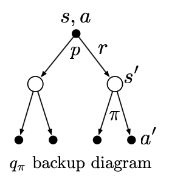

# Exercise 3.17 - Bellman equation for action-values

**Problem Statement**
In Example 3.6 (below), what is the Bellman equation for action values, that is, for $q_\pi$? It must give the action value $q_\pi(s,a)$ in terms of the action values, $q_\pi(s',a')$, of possible successors to the state-action pair $(s,a)$. Hint: The backup diagram to the right corresponds to this equation. Show the sequence of equations analogous to (3.14), but for action values. 

## Equation 3.14

$$v_\pi(s) = \sum\limits_a \pi(a | s) \sum\limits_{s',r}p(s',r|s,a)[r + \gamma v_\pi(s')] \quad \forall s \in \mathcal{S} \tag{3.14}$$

## Example 3.6: Golf

To formulate playing a hole of golf as a reinforcement learning task, we count a penalty (negative reward) of -1 for each stoke until we hit the ball into the hole. The state is the location of the ball. The value of a state is the negative of the number of strokes to the hole from that location. Our actions are how we aim and swing at the ball, of course, and which club we select. Let us take the former as given and consider just the choice of club, which we assume is either a putter or a driver. The upper part of Figure 3.3 shows a possible state-value function, $v_\text{putt}(s)$, for the policy that always uses the putter. The terminal state *in-the-hole* has a value of 0. From anywhere on the green we assume we can make a putt; these states have value -1. Off the green we cannot reach the hole by putting, and the value is greater. If we can reach the green from a state by putting, then that state must have value one less than the green's value, that is, -2. For simplicity, let us assume we can putt very precisely and deterministically, but with a limited range. This gives us the sharp contour line labeled -2 in the figure (below); all locations between that line and the green require exactly two strokes to complete the hole. Similarly, any location within putting range of the -2 contour line must have a value of -3, and so on to get all the contour lines shown in the figure. Putting doesn't get us out of sand traps, so they have a value of $-\infty$. Overall, it takes us six strokes to get from the tee to the hole by putting.

Figure 3.3: A golf example: the state-value function for putting (upper) and the optimal action-value function for using the driver (lower). 

# Solution
By definition,

$$q_\pi(s,a) \doteq \mathbb{E}_\pi[G_t | S_t=s, A_t=a]$$

We can derive a Bellman equation for action-values using the same approach that is used to derive the state-value Bellman equation.

First substitute the recurrence $G_t = R_{t+1} + \gamma G_{t+1}$.

$$q_\pi(s,a) = \mathbb{E}_\pi[R_{t+1} + \gamma G_{t+1} | S_t=s, A_t=a]$$

By linearity of expectation

$$q_\pi(s,a) = \mathbb{E}_\pi[R_{t+1} | S_t=s, A_t=a] + \gamma \mathbb{E}_\pi[G_{t+1} | S_t=s, A_t=a]$$

By definition of expectation, the first expected value is

$$\mathbb{E}_\pi[R_{t+1} | S_t=s, A_t=a] = \sum\limits_{r \in \mathcal{R}} r p(r | s, a)$$

We can relate $p(r|s,a)$ to the dynamics function via marginalization $\sum\limits_{s' \in \mathcal{S}} p(s', r|s,a)$

So the first expectation is

$$\mathbb{E}_\pi[R_{t+1}|S_t=s, A_t=a] = \sum\limits_{s', r} r p(s', r | s, a)$$

For the second expected value, we can use the Law of Total Expectation to introduce, via conditioning, $S_{t+1}, R_{t+1}, A_{t+1}$ and rewrite the expectation as $q_\pi$

$$\mathbb{E}_\pi[G_{t+1} | S_t=s, A_t=a] = \\ \sum\limits_{s'} \sum\limits_{r} \sum\limits_{a'} \mathbb{E}_\pi[G_{t+1} | S_{t+1}=s', A_{t+1}=a', R_{t+1}=r, S_t=s, A_t=a]p(a', s', r | s, a)$$

By definition of return, $G_{t+1}$ is independent of $R_{t+1}$ and, conditional on $S_{t+1}$, $G_{t+1}$ is also independent of $S_t, A_t$ so we can drop those conditioning variables.

$$\mathbb{E}_\pi[G_{t+1}|S_t=s,A_t=a] = \sum\limits_{s', r, a'} \mathbb{E}_\pi[G_{t+1} | S_{t+1}=s', A_{t+1}=a']p(a',s',r|s,a) \\= \sum\limits_{s', r, a'} q_\pi(s', a') p(a',s',r|s,a)$$

We can factorize $p(a',s',r|s,a)$ into more familiar terms $p(s', r|s,a)\pi(a'|s')$

$$\mathbb{E}_\pi[G_{t+1}|S_t=s,A_t=a] = \sum\limits_{s', r, a'} q_\pi(s', a') p(s',r|s,a)\pi(a'|s')$$

Let's combine the two expectation terms that we've rewritten

$$q_\pi(s, a) = \sum\limits_{s', r} rp(s',r|s,a) + \gamma \sum\limits_{s',r,a'}q_\pi(s',a')p(s',r|s,a)\pi(a'|s')$$

Assuming finite sets $\mathcal{S, R, A}$ and finite action-values and rewards, by Fubini's theorem we can interchange the order of summation. Note that $p(s',r|s,a)$ does not depend on $a'$ and so we can pull it in front of that sum

$$q_\pi(s, a) = \sum\limits_{s', r} rp(s',r|s,a) + \gamma \sum\limits_{s', r} p(s',r|s,a) \sum\limits_{a'}q_\pi(s',a')\pi(a'|s')$$

Now we can combine the double sum over $s', r$

$$q_\pi(s, a) = \sum\limits_{s', r}\left( rp(s',r|s,a) + \gamma p(s',r|s,a) \sum\limits_{a'}q_\pi(s',a')\pi(a'|s')\right)$$

And finally factor out the common term $p(s',r|s,a)$

$$\therefore \boxed{q_\pi(s, a) = \sum\limits_{s', r}\left(p(s',r|s,a)[r + \gamma \sum\limits_{a'}q_\pi(s',a')\pi(a'|s')]\right) \quad \forall a, s \in \mathcal{A,S}}$$

This is the action-value Bellman equation that relates current action-values to those of their state-action successors. It can also be expressed as an expectation

$$q_\pi(s, a) = \mathbb{E}_{p, \pi}[R_{t+1} + \gamma q_\pi(S_{t+1}, A_{t+1})|S_t=s, A_t=a]$$

In words, the action-value of a given state-action pair is the expected immediate reward plus the discounted expected action-value of that pair's successor (state, action) pairs.