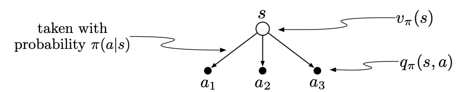

# Exercise 3.18 - State-value in terms of action-value

**Problem Statement**
The value of a state depends on the values of the actions possible in that state and on how likely each action is to be taken under the current policy. We can think of this in terms of a small backup diagram rooted at the state and considering each possible action:

Give the equation corresponding to this intuition and diagram for the value at the root node, $v_\pi(s)$, in terms of the value at the expected leaf node, $q_\pi(s,a)$, given $S_t=s$. This equation should include an expectation conditioned on following the policy, $\pi$. Then give a second equation in which the expected value is written out explicitly in terms of $\pi(a|s)$ such that no expected value notation appears in the equation.

# Solution
Recall the definition

$$v_\pi(s) = \mathbb{E}_\pi[G_t | S_t=s]$$

By the Law of Total Expectation

$$v_\pi(s) = \mathbb{E}_{A_t}[\mathbb{E}_\pi[G_t | S_t=s, A_t=a] | S_t=s]$$

The inner expectation is the definition of $q_\pi(s, a)$

$$\boxed{v_\pi(s) = \mathbb{E}_{A_t}[q_\pi(s,a) | S_t=s]} \tag{1}$$

Since $A_t \sim \pi(a|s)$, by definition of expected value

$$\boxed{v_\pi(s) = \sum\limits_{a \in \mathcal{A}(s)} q_\pi(s, a) \pi(a | s)} \tag{2}$$

Equation (1) and (2) show that the state-value of a state $s$ is the expected action-value over all actions available from that state. Equation (2) highlights that the weights in this expectation come from the agent's policy, since that is what determines which actions are taken.