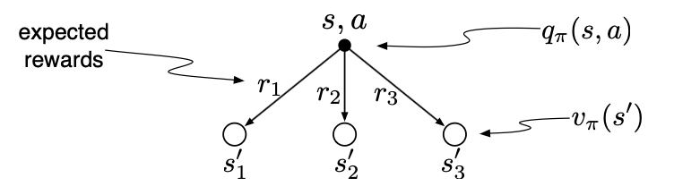

# Exercise 3.19 - Action-values in terms of state-values

**Problem Statement**
The value of an action, $q_\pi(s,a)$, depends on the expected next reward and the expected sum of the remaining rewards. Again we can think of this in terms of a small backup diagram, this one rooted at an action (state-action pair) and branching to the possible next states:

Give the equation corresponding to this intuition and diagram for the action value, $q_\pi(s,a)$, in terms of the expected next reward, $R_{t+1}$, and the expected next state value, $v_\pi(S_{t+1})$, given that $S_t=s, A_t=a$. This equation should include an expectation but *not* one conditioned on following the policy. Then give a second equation, writing out the expected value explicitly in terms of $p(s',r|s,a)$ defined by equation 3.2 (below), such that no expected value notation appears in the equation. 

Equation 3.2

$$p(s',r|s,a) \doteq \Pr\{S_t=s', R_t=r | S_{t-1}=s, A_{t-1}=a\} \\ \forall s',s \in \mathcal{S}, r \in \mathcal{R}, a \in \mathcal{A}(s)\tag{3.2}$$

# Solution
Recall the definition 

$$q_\pi(s,a) = \mathbb{E}_\pi[G_t | S_t=s, A_t=a]$$

Substitute the recurrence $G_t = R_{t+1} + \gamma G_{t+1}$

$$q_\pi(s, a) = \mathbb{E}_\pi[R_{t+1} + \gamma G_{t+1} | S_t=s, A_t=a]$$

By linearity of expectation

$$q_\pi(s, a) = \mathbb{E}_\pi[R_{t+1} | S_t=s, A_t=a] + \gamma \mathbb{E}_\pi[G_{t+1} | S_t=s, A_t=a]$$

To introduce $v_\pi(S_{t+1})$ we can use the Law of Total Expectation

$$q_\pi(s, a) = \mathbb{E}_\pi[R_{t+1} | S_t=s, A_t=a] + \\ \gamma \sum\limits_{s', r} \mathbb{E}_\pi[G_{t+1} | S_{t+1}=s', R_{t+1}=r, S_t=s, A_t=a]p(s', r | s, a)$$

By the Markov property, conditioning on $S_t, A_t$ provides no information beyond $S_{t+1}$ so we can remove them. Also, $G_{t=1}$ is independent of $R_{t+1}$ conditional on $S_{t+1}$. 

$$q_\pi(s, a) = \mathbb{E}_\pi[R_{t+1} | S_t=s, A_t=a] + \gamma \sum\limits_{s', r} \mathbb{E}_\pi[G_{t+1} | S_{t+1}=s']p(s', r | s, a)$$

Rewrite in terms of $v_\pi$

$$q_\pi(s, a) = \mathbb{E}_\pi[R_{t+1} | S_t=s, A_t=a] + \gamma \sum\limits_{s', r} v_\pi(s') p(s', r | s, a)$$

Recognize the double sum as a conditional expectation over next state-values

$$q_\pi(s, a) = \mathbb{E}[R_{t+1} | S_t=s, A_t=a] + \gamma \mathbb{E}[v_\pi(S_{t+1}) | S_t=s, A_t=a]$$

Note that we can drop the subscript $\pi$ on the expectations since once $(s,a)$ are conditioned on, the only randomness comes from the transition dynamics not the policy. By linearity of expectation we can combine the two

$$\boxed{q_\pi(s, a) = \mathbb{E}[R_{t+1} + \gamma v_\pi(S_{t+1}) | S_t=s, A_t=a]}$$

This shows that the action-value is the expected next reward plus the discounted next state value. 

To remove the expectation from the equation we have

$$q_\pi(s, a) = \sum\limits_{s', r} r p(s', r | s, a) + \gamma \sum\limits_{s', r} v_\pi(s') p(s', r | s, a)$$

Group the sums and factor out $p(s', r|s,a)$

$$\boxed{q_\pi(s, a) = \sum\limits_{s', r} p(s', r | s, a)[r + \gamma v_\pi(s')]}$$