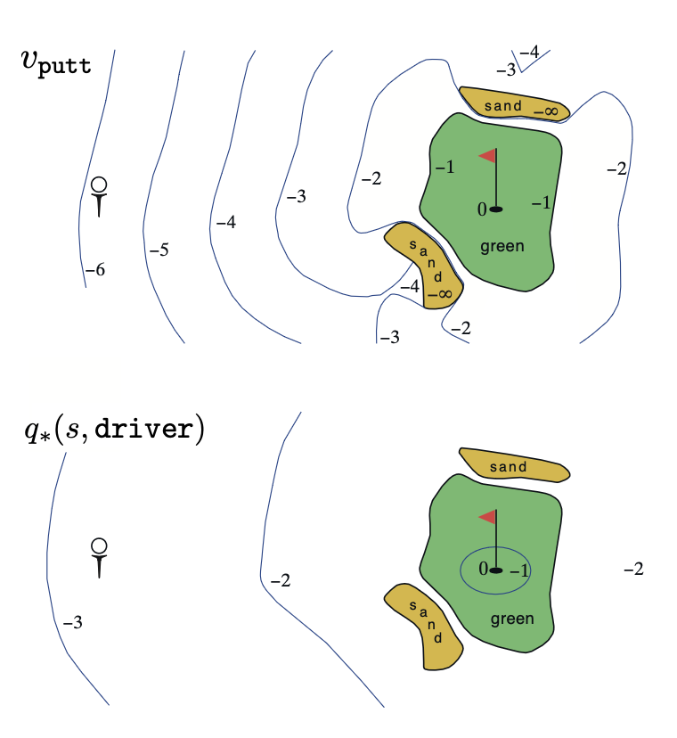
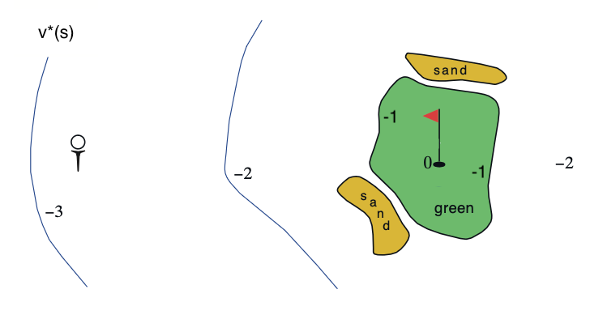

# Exercise 3.20 – Optimal state-value function for golf

**Problem Statement**
Draw or describe the optimal state-value function for the golf example (below).

## Example 3.6: Golf

To formulate playing a hole of golf as a reinforcement learning task, we count a penalty (negative reward) of -1 for each stoke until we hit the ball into the hole. The state is the location of the ball. The value of a state is the negative of the number of strokes to the hole from that location. Our actions are how we aim and swing at the ball, of course, and which club we select. Let us take the former as given and consider just the choice of club, which we assume is either a putter or a driver. The upper part of Figure 3.3 shows a possible state-value function, $v_\text{putt}(s)$, for the policy that always uses the putter. The terminal state *in-the-hole* has a value of 0. From anywhere on the green we assume we can make a putt; these states have value -1. Off the green we cannot reach the hole by putting, and the value is greater. If we can reach the green from a state by putting, then that state must have value one less than the green's value, that is, -2. For simplicity, let us assume we can putt very precisely and deterministically, but with a limited range. This gives us the sharp contour line labeled -2 in the figure (below); all locations between that line and the green require exactly two strokes to complete the hole. Similarly, any location within putting range of the -2 contour line must have a value of -3, and so on to get all the contour lines shown in the figure. Putting doesn't get us out of sand traps, so they have a value of $-\infty$. Overall, it takes us six strokes to get from the tee to the hole by putting.

Figure 3.3: A golf example: the state-value function for putting (upper) and the optimal action-value function for using the driver (lower). 

# Solution
Recall the relationship $v_*(s) = \max\limits_a q_*(s, a)$. In the golf example, there are just two actions, to choose the golf club from {putt, driver}. So we can rewrite this relationship more specifically

$$v_*(s) = \max\limits_{a \in \{\text{putt, driver}\}} q_*(s,a) \quad \forall s \in \mathcal{S}$$

Note that $\mathcal{S}$ is the set of all possible locations of the ball, which is uncountably infinite if we assume real-valued locations.

We are told that the value of a state is the negative of the *number of strokes* to the hole from that location. So locations closer to the hole, which require fewer strokes to sink, have greater (i.e. less negative) value. So we know that the optimal state-value function will roughly increase as the location approaches the hole. At the hole itself, the optimal state-value will assign a value of 0. 

We are told that a putt can sink a ball anywhere on the green in one shot. So the optimal state-value function will assign -1 to all points on the green. 

From the lower half of Figure 3.3, we can tell that a driver can hit the ball from the tee to the -2 region and from the -2 region to the green. So the optimal policy would use a driver for the first shot, a driver for the second shot (reaching the green) and then putt into the hole on the third shot. This means that the optimal state-value function diagram will look the same as $q_*(s, \text{driver})$ in Figure 3.3 except the entire green will have value -1 since the optimal policy will switch to a putter instead of sticking with a driver.

Visually, the optimal state-value function $v_*(s)$ looks like this:

