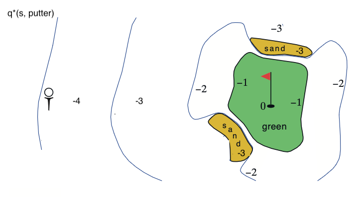

# Exercise 3.21 – Optimal action-value function for putting

**Problem Statement**
[Continuing from [Exercise 3.20](../ch03_ex03-20/README.md)] Draw or describe the contours of the optimal action-value function for putting, $q_*(s, \text{putter})$, for the golf example.

# Solution
I will take $q_*(s, \text{putter})$ to mean "take a putt now, then behave optimally from the next stroke on," as opposed to "use the putter from all locations", i.e. $q_*(s, \text{putter}) \quad \forall s \in \mathcal{S}$. 

I will also assume that the -2 contour in Figure 3-3 (lower) is roughly aligned with the -3 contour of Figure 3-3 (upper). Things get messy around there.

From the description of the golf example we know that it takes 6 putts to reach the hole from the tee. 

Let's analyze each contour of the $v_{\text{putt}}$ diagram in Fig 3-3 individually. From the -6 region, the agent will putt to the -5 region but from there they will switch to a driver and hit the ball to the -2 region in the $q_*(s, \text{driver})$ portion of the diagram. From there, they will use the driver once more to reach the green and finally putt into the hole. So the -6 region becomes -4 under $q_*(s, \text{putter})$. 

From the -5 region in $v_\text{putt}$, the agent will put it to the -4 region, which I'm assuming corresponds to the -3 region in the $q_*(s, \text{driver})$ part of figure 3-3. From there the agent will use the driver to reach the green and use the putter to sink the hole. So the -5 region becomes -4 under $q_*(s, \text{putter})$.

By a similar logic, the -4 region on $v_\text{putt}$ will follow: putt, drive, putt so becomes -3. The -3 region on $v_\text{putt}$ will follow: putt, putt, putt so remains -3. The -2 region on $v_\text{putt}$ will follow: putt, putt so remains -2. The green region will consist of -1 everywhere since the first shot under $q_*(s, \text{putter})$ is a putt and is guaranteed to sink the hole. Lastly, the sand traps will follow: putt (remaining in the sand trap), drive to the green, putt so become -3 under $q_*(s, \text{putter})$. And of course the hole itself remains at an action-value of 0 since it is a terminal state.

Putting that altogether, with reference to the contours in $v_\text{putt}$:
-6 -> -4
-5 -> -4
-4 -> -3
-3 -> -3
-2 -> -2
Green: -1 everywhere
Sand traps: -3
Hole: 0

Visually, that looks like this:

