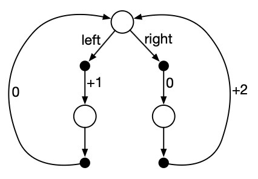

# Exercise 3.22 – Policy optimality under different discount factors

**Problem Statement**
Consider the continuing MDP shown below. The only decision to be made is that in the top state, where two actions are available, left and right. The numbers show the rewards that are received deterministically after each action. There are exactly two deterministic policies, $\pi_\text{left}$ and $\pi_\text{right}$. What policy is optimal if $\gamma=0$? If $\gamma=0.9$? If $\gamma=0.5$?

# Solution
We can determine which policy is optimal using the state-value functions:

$\pi \succeq \pi' \iff v_\pi(s) \ge v_{\pi'}(s) \quad \forall s \in \mathcal{S}$

There are 3 states. Let $s_T, s_L, s_R$ denote the top (center), left and right states in the MDP diagram. Let's determine the value of each of the 3 states under both policies for the 3 values of $\gamma$. 

**Top State $s_T$**

By definition $v_\pi(s) \doteq \mathbb{E}_\pi[G_t | S_t=s] = \mathbb{E}_\pi[R_{t+1} + \gamma G_{t+1} | S_t=s]$

For $\gamma=0$:

$v_{\pi_\text{left}}(s_T) = \mathbb{E}_{\pi_\text{left}}[R_{t+1}] = +1$

$v_{\pi_\text{right}}(s_T) = \mathbb{E}_{\pi_\text{right}}[R_{t+1}] = 0$

For $\gamma=0.9$ and $\gamma=0.5$:

We need to compute the return $G_t = \sum\limits_{k=0}^\infty \gamma^k R_{t + k + 1}$ for both policies. Under $\pi_\text{left}$, the sequence of rewards will be $+1, 0, +1, 0, ...$ whereas under $\pi_\text{right}$ it will be $0, +2, 0, +2, 0, ...$. This means $G_t$ will consist of only the even powers of $\gamma^k$ under $\pi_\text{left}$ and the odd powers under $\pi_\text{right}$. 

Since the sum is infinite, we can write the even-power-only sum as $G_t = \sum\limits_{k=0}^\infty \gamma^{2k}$ and this is an infinite geometric series with limit $\frac{1}{1-\gamma^2}$. We can do the same for the odd-power-only sum $\sum\limits_{k=0}^\infty \gamma^{2k + 1} = \gamma \sum\limits_{k=0}^\infty \gamma^{2k} = \frac{\gamma}{1-\gamma^2}$. But recall that the odd-only-power sum is multiplied by the constant reward of 2, so $G_t = \frac{2\gamma}{1-\gamma^2}$.

So for $\gamma=0.9$, 

$v_{\pi_\text{left}}(s_T) = \mathbb{E}_{\pi_\text{left}}[G_t | S_t = s_T] = \frac{1}{1-\gamma^2} \approx 5.26$

$v_{\pi_\text{right}}(s_T) = \mathbb{E}_{\pi_\text{right}}[G_t | S_t = s_T] = \frac{2\gamma}{1-\gamma^2} \approx 9.47$

For $\gamma=0.5$,

$v_{\pi_\text{left}}(s_T) = \mathbb{E}_{\pi_\text{left}}[G_t | S_t = s_T] = \frac{1}{1-\gamma^2} = 4/3$

$v_{\pi_\text{right}}(s_T) = \mathbb{E}_{\pi_\text{right}}[G_t | S_t = s_T] = \frac{2\gamma}{1-\gamma^2} = 4/3$

**Left & Right States $s_L, s_R$**

Because there are no decisions to be made in either of these two states, we can use the fact that

$v_\pi(s) = \mathbb{E}_\pi[R_{t+1} + \gamma G_{t+1} | S_t=s]$

To quickly obtain the value of $s_L, s_R$ under both policies. 

$v_{\pi_\text{left}}(s_L) = 0 + \frac{\gamma}{1-\gamma^2} = \frac{\gamma}{1-\gamma^2}$

$v_{\pi_\text{right}}(s_L) = 0 + \frac{2\gamma^2}{1-\gamma^2} = \frac{2\gamma^2}{1-\gamma^2}$

$v_{\pi_\text{left}}(s_R) = 2 + \frac{\gamma}{1-\gamma^2}$

$v_{\pi_\text{right}}(s_R) = 2 + \frac{2\gamma^2}{1-\gamma^2}$

Hence for $\gamma=0.9$, $v_{\pi_\text{left}}(s_L) \approx 4.74, v_{\pi_\text{right}}(s_L) \approx 8.53, v_{\pi_\text{left}}(s_R) \approx 6.74, v_{\pi_\text{right}}(s_R) \approx 10.53$.

And for $\gamma=0.5$, $v_{\pi_\text{left}}(s_L) \approx 2/3, v_{\pi_\text{right}}(s_L) \approx 2/3, v_{\pi_\text{left}}(s_R) \approx 8/3, v_{\pi_\text{right}}(s_R) \approx 8/3$.

Lastly, for $\gamma=0$, $v(s_L)=0, v(s_R)=2$ under both policies.

In summary, the values of the three states under the three values of gamma are:

### $\gamma = 0$

| State | $\pi_\text{left}$ | $\pi_\text{right}$ |
|-------|:------:|:-------:|
| $s_T$   | 1.0 | 0.0 |
| $s_L$   | 0.0 | 0.0 |
| $s_R$   | 2.0 | 2.0 |

---

### $\gamma = 0.5$

| State | $\pi_\text{left}$ | $\pi_\text{right}$ |
|-------|:------:|:-------:|
| $s_T$   | 4/3 | 4/3 |
| $s_L$   | 2/3 | 2/3 |
| $s_R$   | 8/3 | 8/3 |

---

### $\gamma = 0.9$

| State | $\pi_\text{left}$ | $\pi_\text{right}$ |
|-------|:------:|:-------:|
| $s_T$   | 5.26 | 9.47 |
| $s_L$   | 4.74 | 8.53 |
| $s_R$   | 6.74 | 10.53 |

$\therefore$ For $\gamma=0$, $\pi_\text{left} \succeq \pi_\text{right}$. For $\gamma=0.5$, the two policies are equal. For $\gamma=0.9$, $\pi_\text{right} \succeq \pi_\text{left}$ by the partial order definition of optimality at the start of this solution.
