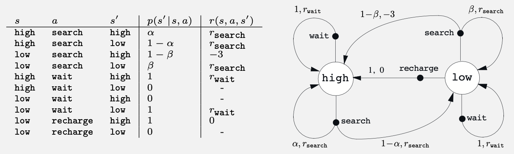

# Exercise 3.23 – Optimal action-value equation for recycling robot

**Problem Statement** 
Give the Bellman equation for $q_*$ for the recycling robot from Example 3.3 (below).

## Example 3.3 Recycling Robot
A mobile robot has the job of collecting empty soda cans in an office environment. It has sensors for detecting cans, and an arm and gripper that can pick them up and place them in an onboard bin; it runs on a rechargeable battery. The robot’s control system has components for interpreting sensory information, for navigating, and for controlling the arm and gripper. High‑level decisions about how to search for cans are made by a reinforcement learning agent based on the current charge level of the battery. To make a simple example, we assume that only two charge levels can be distinguished, comprising a small state set S = {high, low}. In each state, the agent can decide whether to (1) actively search for a can for a certain period of time, (2) remain stationary and wait for someone to bring it a can, or (3) head back to its home base to recharge its battery. When the energy level is high, recharging would always be foolish, so we do not include it in the action set for this state. The action sets are then 𝒜(high) = {search, wait} and 𝒜(low) = {search, wait, recharge}.

The rewards are zero most of the time, but become positive when the robot secures an empty can, or large and negative if the battery runs all the way down. The best way to find cans is to actively search for them, but this runs down the robot’s battery, whereas waiting does not. Whenever the robot is searching, the possibility exists that its battery will become depleted. In this case the robot must shut down and wait to be rescued (producing a low reward). If the energy level is high, then a period of active search can always be completed without risk of depleting the battery. A period of searching that begins with a high energy level leaves the energy level high with probability α and reduces it to low with probability 1 − α. On the other hand, a period of searching undertaken when the energy level is low leaves it low with probability β and depletes the battery with probability 1 − β. In the latter case, the robot must be rescued, and the battery is then recharged back to high. Each can collected by the robot counts as a unit reward, whereas a reward of −3 results whenever the robot has to be rescued. Let r_search and r_wait, with r_search > r_wait, respectively denote the expected number of cans the robot will collect (and hence the expected reward) while searching and while waiting. Finally, suppose that no cans can be collected during a run home for recharging, and that no cans can be collected on a step in which the battery is depleted. This system is then a finite MDP, and we can write down the transition probabilities and the expected rewards, with dynamics as indicated in the table on the left:

Note that there is a row in the table for each possible combination of current state, *s*, action, *a ∈ A(s)*, and next state, *s′*. Some transitions have zero probability of occurring, so no expected reward is specified for them. Shown on the right is another useful way of summarizing the dynamics of a finite MDP, as a **transition graph**. There are two kinds of nodes: **state nodes** and **action nodes**. There is a state node for each possible state (a large open circle labeled by the name of the state), and an action node for each state–action pair (a small solid circle labeled by the name of the action and connected by a line to the state node). Starting in state *s* and taking action *a* moves you along the line from state node *s* to action node *(s, a)*. Then the environment responds with a transition to the next state’s node via one of the arrows leaving action node *(s, a)*. Each arrow corresponds to a triple *(s, s′, a)*, where *s′* is the next state, and we label the arrow with the transition probability, *p(s′ | s, a)*, and the expected reward for that transition, *r(s, a, s′)*. Note that the transition probabilities labeling the arrows leaving an action node always sum to 1.

# Solution
By definition $q_*(s,a) \doteq \max\limits_\pi \mathbb{E}_\pi[G_t | S_t = s, A_t = a]$

And the Bellman optimality equation for $q_*$ is

$$q_*(s,a) = \sum\limits_{s'} p(s'|s,a)[r(s, a, s') + \gamma \max\limits_{a'} q_*(s', a')] \quad \forall s, a \in \mathcal{S, A}(s)$$

So there is one such equation for every state-action pair. In the recycling robot example, there are two states and 3 actions but only 5 state-action pairs since the recharge action is not an option when the robot's battery is high. Hence we can write out 5 action-value optimality equations. In each equation, the sum over all states $s'$ consists of just two terms since there are only two states. So we can list them explicitly. Without solving this system of 5 non-linear equations we do not have the information required to rewrite/disambiguate the $\max\limits_{a'}$ so we leave it in each equation symbolically.

$q_*(\text{high}, \text{search}) = \alpha(r_\text{search} + \gamma \max\limits_{a'} q_*(\text{high}, a')) + (1-\alpha)(r_\text{search} + \gamma \max\limits_{a'} q_*(\text{low}, a'))$

$q_*(\text{low}, \text{search}) = \beta(r_\text{search} + \gamma \max\limits_{a'} q_*(\text{low}, a')) + (1-\beta)(-3 + \gamma \max\limits_{a'} q_*(\text{high}, a'))$

$q_*(\text{high}, \text{wait}) = r_\text{wait} + \gamma \max\limits_{a'} q_*(\text{high}, a')$

$q_*(\text{low}, \text{wait}) = r_\text{wait} + \gamma \max\limits_{a'} q_*(\text{low}, a')$

$q_*(\text{low}, \text{recharge}) = \gamma \max\limits_{a'} q_*(\text{high}, a')$