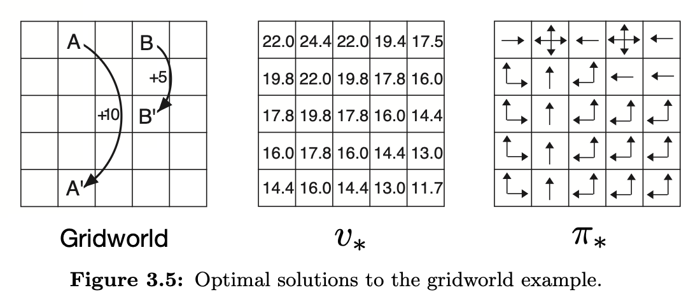

# Exercise 3.24 – Optimal state-value from the optimal policy

**Problem Statement** 
Figure 3.5 gives the optimal value of the best state of the gridworld as 24.4, to one decimal place. Use your knowledge of the optimal policy and equation (3.8) to express this value symbolically, and then to compute it to three decimal places.

## Equation 3.8

$$G_t \doteq R_{t+1} + \gamma R_{t+2} + \gamma^2 R_{t+3} + ... = \sum\limits_{k=0}^\infty \gamma^k R_{t+k+1}$$

# Solution
We know that 

$$v_*(s) = \max\limits_{a \in \mathcal{A}(s)} q_{\pi_*}(s,a) = \max\limits_a \mathbb{E}_{\pi_*}[G_t | S_t = s, A_t=a]$$

Substitute $s = A$ (the state whose optimal value we wish to compute)

$$v_*(A) = \max\limits_{a \in \mathcal{A}(A)} q_{\pi_*}(A,a) = \max\limits_{a \in \mathcal{A}(A)} \mathbb{E}_{\pi_*}[G_t | S_t = A, A_t=a]$$

Since all four actions taken in state $A$ result in the same transition to state $A'$, the expected value will be equal for all values of $a \in \mathcal{A}(A)$. So we can pick one arbitrarily and remove the $\max$

$$v_*(A) = \mathbb{E}_{\pi_*}[G_t | S_t = A, A_t=\text{up}]$$

Let's study the random variable $G_t$. We know by equation 3.8 that $G_t$ is the discounted sum of future rewards. And since we know the optimal policy (see Figure 3.5; right), and the dynamics of this environment, we know that the rewards will follow a deterministic sequence. An arbitrary action will be taken in state $A$ resulting in +10 reward. This transitions to state $A'$ and the optimal policy will select 'up' until it reaches state $A$ again, and so on repeating. Each of the transitions upwards from state $A'$ to $A$ result in a reward of 0. Therefore, starting at state $A$ the future rewards under the optimal policy will follow the deterministic sequence $10, 0,0,0,0, 10, 0,0,0,0, 10, ...$. Hence only the $\gamma$ terms in $G_t$ with exponents that are divisible by 5 (including 0) will have non-zero reward. We can therefore rewrite $G_t = 10 \sum\limits_{k=0}^\infty \gamma^{5k}$. Observe that the sum is the infinite geometric series with limit $\frac{1}{1 - \gamma^5}$. 

Therefore, $G_t = \frac{10}{1 - \gamma^5}$, which is a constant so taking its expectation has no effect. 

$\therefore \boxed{v_*(A) = \frac{10}{1 - \gamma^5} = 24.419428097 \approx 24.419}$

To three decimal places, the optimal state-value of state $A$ in Gridworld is 24.419. 