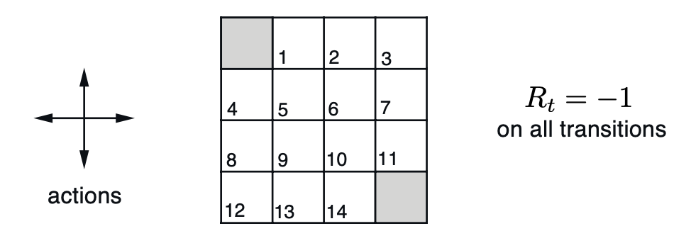
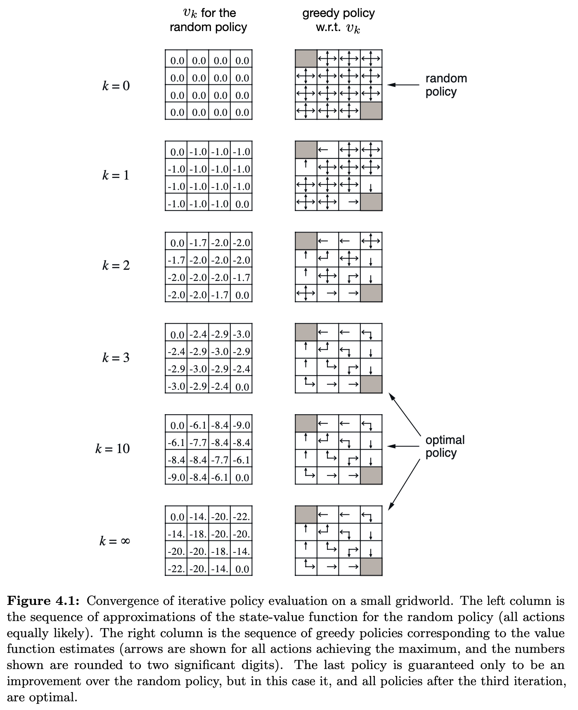

# Exercise 4.1 - Action-values of a Random Policy in Gridworld

**Problem Statement**
In Example 4.1, if $\pi$ is the equiprobable random policy, what is $q_\pi(11, \text{down})$? What is $q_\pi(7, \text{down})$?

## Example 4.1 - Consider the 4 x 4 gridworld shown below

The nonterminal states are $\mathcal{S} = \{1,2,...,14\}$. There are four actions possible in each state, $\mathcal{A} = \{\text{up, down, right, left}\}$, which deterministically cause the corresponding state transitions, except that actions that would take the agent off the grid in fact leave the state unchanged. Thus, for instance, $p(6,-1|5,\text{right}) = 1, p(7, -1|7, \text{right})=1,$ and $p(10, r|5, \text{right})=0$ for all $r \in \mathcal{R}$. This is an undiscounted, episodic task. The reward is -1 on all transitions until the terminal state is reached. The terminal state is shaded in the figure (although it is shown in two places, it is formally one state). The expected reward function is thus $r(s,a,s')=-1$ for all states $s, s'$ and actions $a$. Suppose the agent follows the equiprobable random policy (all actions equally likely). The left side of Figure 4.1 shows the sequence of value functions $\{v_k\}$ computed by iterative policy evaluation. The final estimate is in fact $v_\pi$, which in this case gives for each state the negation of the expected number of steps from that state until termination. 

# Solution

By definition 

$q_\pi(11, \text{down}) \doteq \mathbb{E}_\pi[G_t | S_t=11, A_t=\text{down}] \\q_\pi(11, \text{down}) = \mathbb{E}_\pi[\sum\limits_{k=0}^\infty \gamma^k R_{t + k + 1} | S_t=11, A_t=\text{down}]$

But we are told that this task is undiscounted so $\gamma=1$. 

$\\q_\pi(11, \text{down}) = \mathbb{E}_\pi[\sum\limits_{k=0}^\infty R_{t + k + 1} | S_t=11, A_t=\text{down}]$

We know that the transitions are deterministic and so 'down' from state 11 will lead to the terminal state. This means the infinite sum will only contain a single non-zero reward, $R_{t+1} = -1$. 

$q_\pi(11, \text{down}) = \mathbb{E}_\pi[-1 | S_t=11, A_t=\text{down}] = -1$

$\therefore \boxed{q_\pi(11, \text{down}) = -1}$

As for $q_\pi(7, \text{down})$, from [Exercise 3.19](../ch03_ex03-19/README.md), we know that action-values can be expressed in terms of state-values:

$$q_\pi(s, a) = \sum\limits_{s', r} p(s', r | s, a)[r + \gamma v_\pi(s')]$$

We know that $p(s',r|s,a)$ is 1 for all legal transitions and 0 otherwise. So we can take the double sum over legal $(s',r)$ pairs and drop the dynamics function. We also know that $r=-1$ for all legal transitions. And $\gamma=1$. Making these substitutions we get

$$q_\pi(7, \text{down}) = -1 + v_\pi(11)$$

But the state-values are given in Figure 4.1 so

$\therefore \boxed{q_\pi(7, \text{down}) = -1 + (-14) = -15}$